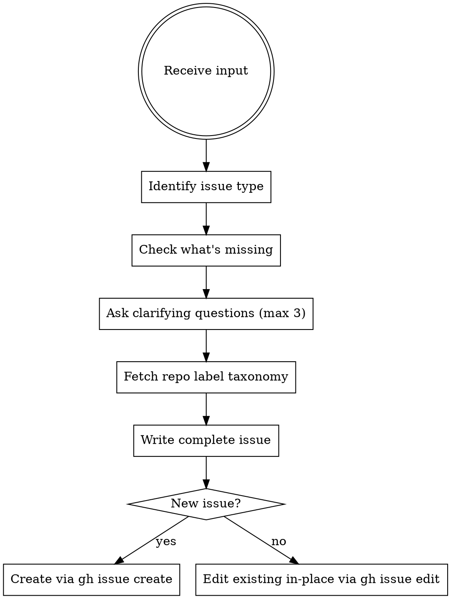

# Issue Writer

## Overview

Turn vague ideas into complete, actionable GitHub issues. Always ask targeted clarifying questions before writing. Never invent scope. Never make up labels.

## Workflow



## Step 1: Identify Issue Type

| Type | Key signal |
|------|-----------|
| **Bug** | Something broken, crash, wrong behavior |
| **Feature** | New capability, "add X", "I want Y" |
| **Improvement** | Existing thing but better, performance, UX |
| **Chore** | Refactor, cleanup, infra, no user-visible change |

## Step 2: Required Fields by Type

**Bug:**
- Steps to reproduce (numbered, specific)
- Expected behavior
- Actual behavior
- Platform / environment
- Frequency (always / sometimes / once)
- Error message or stack trace (if any)

**Feature:**
- User story: "As a [user], I want [X] so that [Y]"
- Acceptance criteria (checkbox list)
- Scope — what is explicitly OUT of this issue
- Any design references

**Improvement:**
- What's currently bad (specific, measurable if possible)
- What "done" looks like
- Acceptance criteria

**Chore:**
- What changes and why
- Definition of done

## Step 3: Ask Clarifying Questions

**Ask before writing.** Max 3 questions. Ask only for what's truly missing — don't interrogate.

Prioritize by impact: missing steps-to-reproduce > missing platform > missing frequency.

**Do NOT skip this step because:**
- "The description seems clear enough" — it isn't, or you wouldn't be writing this issue
- "I can guess from the codebase" — guesses inflate scope and solve the wrong problem
- "The user seems in a hurry" — 2 questions take 30 seconds; fixing the wrong issue takes hours

## Step 4: Fetch Label Taxonomy

Run `gh label list` before assigning labels. Use only labels that exist in the repo. Never invent labels.

## Step 5: Write the Issue

### Bug template

```markdown
## Bug Report

**Summary:** One-sentence description.

## Steps to Reproduce
1. ...
2. ...
3. ...

## Expected Behavior
...

## Actual Behavior
...

## Environment
- OS/Arch: [macOS / Linux / Windows, amd64 / arm64]
- Go version: ...
- Builder version: ...
- Frequency: [always / intermittent (~X% of attempts)]

## Error / Stack Trace
(paste if available)

## Additional Context
...
```

### Feature / Improvement template

```markdown
## Summary
One-sentence description.

## User Story
As a [user], I want [X] so that [Y].

## Acceptance Criteria
- [ ] ...
- [ ] ...

## Out of Scope
- ...

## Design Reference
(link or N/A)
```

## Step 6: Create or Edit

**New issue:**
```bash
gh issue create --title "..." --body "..." --label "bug,area:bug"
```

**In-place edit (existing issue):**
```bash
gh issue edit <number> --title "..." --body "..." --add-label "..." --remove-label "..."
```

For in-place edits: **preserve the original problem statement**. Expand it; don't rewrite it. If the original says "search is slow", don't silently redirect to four different root causes — ask which problem the reporter meant.

## Common Mistakes

| Mistake | Fix |
|---------|-----|
| Writing the issue without asking anything | Always ask 1-3 clarifying questions first |
| Inventing labels | Run `gh label list`, use only what exists |
| In-place edit balloons into a technical deep-dive | Expand scope only on what reporter confirmed |
| Guessing platform/environment | Ask. "macOS / Linux / Windows?" is one question. |
| Acceptance criteria missing | Every bug and feature needs at least one checkbox |
| Assuming "I'll fix it in X way" belongs in the issue | Issues describe the problem + done criteria, not the solution |

## Red Flags — STOP, You're Rationalizing

| Thought | Reality |
|---------|---------|
| "The description is clear, I don't need to ask" | If it were complete you wouldn't be writing this issue |
| "I can infer the platform from the codebase" | Inference ≠ confirmation. Ask. |
| "The user seems busy / just wants it done" | 2 questions = 30 seconds. Wrong issue = wasted sprint. |
| "I'll add all the related problems I found in the code" | Solve what the reporter described, not what you discovered |
| "I'll use these labels, they sound right" | Always run `gh label list` first |
